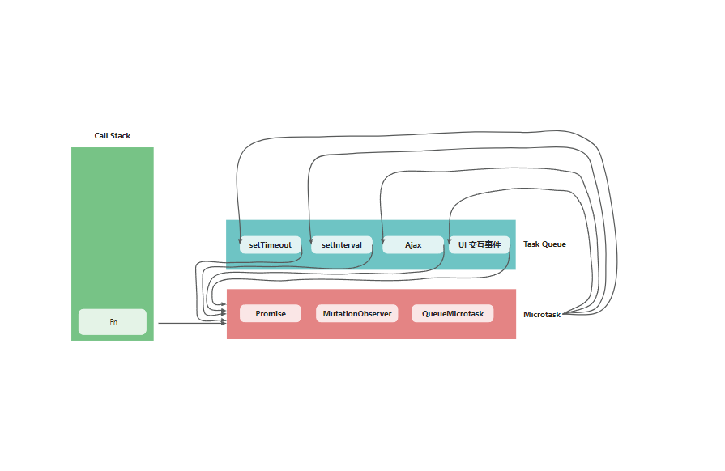

# 浏览器事件循环(Event Loop)

浏览器的事件循环是 JavaScript 实现异步编程的核心机制，它决定了代码的执行顺序和时机。



## 基本架构

- **调用栈（Call Stack）**：后进先出（LIFO）结构，用于执行同步代码

- **任务队列（Task Queue/Macrotask Queue）**：存放宏任务回调

- **微任务队列（Microtask Queue）**：存放微任务回调

- **渲染管道（Render Pipeline）**：负责页面更新渲染

## 运行流程

**1. 执行同步代码：**

- 所有同步代码直接进入调用栈执行
- 遇到异步 API 时，将回调注册到相应队列

**2. 检查调用栈：**

当调用栈为空时，事件循环开始工作

**3. 处理微任务：**

- 执行所有微任务队列中的任务（直到队列清空）

- 微任务包括：Promise 回调、MutationObserver（监听 DOM 变化）、queueMicrotask（ 手动添加微任务）

**4. 渲染更新（如果需要）：**

- 执行 requestAnimationFrame 回调

- 计算样式和布局（重排）

- 绘制页面（重绘）

**tips**

- **requestAnimationFrame** 是一个特殊的宏任务，它会在每次重绘之前执行,非常适合用于动画。比起 **setInterval** 或 **setTimeout**，**requestAnimationFrame** 能保证动画的流畅性，因为它会根据浏览器的刷新率调整动画的执行时机。为什么**setInterval**和**setTimeout**不合适呢？这就下面要说的了**宏任务**。

**5. 处理宏任务：**

- 执行所有宏任务队列中的任务（直到队列清空）

- 宏任务包括：setTimeout、setInterval、I/O(fs 文件操作)、UI 交互事件(click、scroll)等。

**tips**

1. 正是受事件循环的影响，计时器的回调函数只能在主线程空闲时运行，因此会带来了偏差
2. 浏览器的计时器最终调用的是操作系统的函数，而操作系统的计时器精度是有限的，所以计时器的回调函数的执行时间可能会比设定的时间稍晚。
3. 计算机硬件没有原子钟，无法做到精确计时

**6. 重复以上步骤：**

- 循环

## 总结

1. **微任务会阻塞渲染：** 微任务执行期间不会进行渲染

2. **宏任务之间会渲染：** 浏览器可能在各宏任务之间进行渲染

3. **微任务优先级高于宏任务：** 每次宏任务执行后都会清空微任务队列

4. **避免长时间任务：** 超过 50ms 的任务会导致可感知的延迟

## 示例

<script lang="ts">
//   console.log("script start");

// setTimeout(function () {
//   console.log("setTimeout");
// }, 0);

// Promise.resolve()
//   .then(function () {
//     console.log("promise1");
//   })
//   .then(function () {
//     console.log("promise2");
//   });

// function delay(duration) {
//   var start = Date.now();
//   while (Date.now() - start < duration) {}
//   console.log("delay");
// }
// delay(2000); //主线程阻塞2s
// console.log("script end");
</script>

```js
同步代码 > 微任务 > requestAnimationFrame > 渲染 > 宏任务;
```

```js
console.log("script start");

setTimeout(function () {
  console.log("setTimeout");
}, 0);

Promise.resolve()
  .then(function () {
    console.log("promise1");
  })
  .then(function () {
    console.log("promise2");
  });

function delay(duration) {
  var start = Date.now();
  while (Date.now() - start < duration) {}
  console.log("delay");
}
delay(2000); //主线程阻塞2s
console.log("script end");
```

输出顺序：

```
script start
=========== 2s
delay
script end
promise1
promise2
setTimeout
```

## 参考链接

- [浏览器事件循环](https://developer.mozilla.org/zh-CN/docs/Web/JavaScript/Reference/Execution_model)
