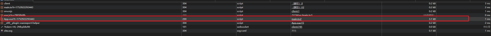
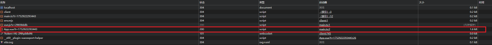
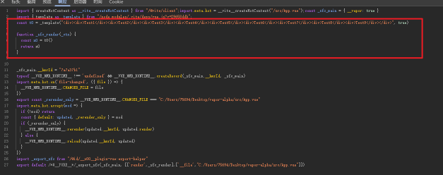

# Vue 3.6.0

## 性能革命：Vapor 模式（抛弃虚拟 DOM）

Vue 3.6 引入了 Vapor 模式，这是一种全新的渲染策略，直接操作真实 DOM，跳过虚拟 DOM 的创建和比对流程，大幅提升性能：

- 性能提升 300%，在高频更新场景下表现尤为突出。

- 内存占用降低 60%，运行时代码体积缩减 60%。

- 10 万组件实例化仅需 100ms，远超传统虚拟 DOM 方案 。

- 支持渐进式迁移，可混用 Vapor 组件和传统组件。

```ts
import { createApp, vaporInteropPlugin } from "vue";
import App from "./App.vue";

createApp(App)
  .use(vaporInteropPlugin) // enable vapor interop
  .mount("#app");
```

```vue
<!-- <script steup lang="ts"></script> //虚拟DOM -->
<script steup vapor lang="ts"></script>

<template>
  <div>
    <div>Test1</div>
    <div>Test2</div>
    <div>Test3</div>
    <div>Test4</div>
    <div>Test5</div>
    <div>Test6</div>
    <div>Test7</div>
    <div>Test8</div>
    <div>Test9</div>
  </div>
</template>
```

## 虚拟 DOM 3.1kb




## Vapor 模式 1.6kb




## 响应式系统升级：Alien Signals

Vue 3.6 重构了响应式核心，采用 Alien Signals 架构，带来以下优化

- 响应式追踪效率提升 60%，内存占用降低 40%。

- 嵌套对象自动代理，无需手动 reactive 深度监听。

- 增量 GC 策略，动态回收未使用的依赖，减少内存碎片。

```js
import { signal } from "vue";
const user = signal({ name: "Jack", permissions: ["read", "write"] });
user.value.permissions.push("admin"); // 自动触发更新
```
