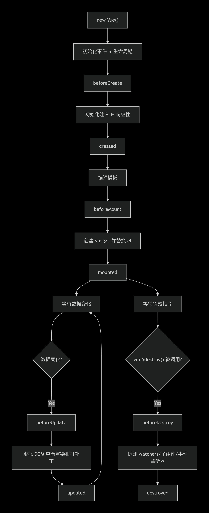

# Vue2 生命周期

## Vue 2 的生命周期可以分为四个主要阶段、8 个主要的钩子函数。下图清晰地展示了它们的流程关系：



## 总结：

```js

new Vue()
|
↓
beforeCreate ←--- 数据观测前，几乎什么都做不了
|
↓
created ←--- 数据已响应式，可进行 API 调用
|
↓
beforeMount ←--- 模板编译完成，但未挂载
|
↓
mounted ←--- 已挂载，可操作 DOM
|
↓
数据变化 → beforeUpdate → 虚拟 DOM 渲染 → updated
|
↓
beforeDestroy ←--- 实例销毁前，清理资源
|
↓
destroyed ←--- 实例已销毁
```

## Vue 3 的生命周期

```js
import {
  onBeforeMount,
  onMounted,
  onBeforeUpdate,
  onUpdated,
  onBeforeUnmount,
  onUnmounted,
} from "vue";

export default {
  setup() {
    onBeforeMount(() => {
      // 在挂载之前
    });
    onMounted(() => {
      // 在挂载之后
    });
    onBeforeUpdate(() => {
      // 在更新之前
    });
    onUpdated(() => {
      // 在更新之后
    });
    onBeforeUnmount(() => {
      // 在卸载之前
    });
    onUnmounted(() => {
      // 在卸载之后
    });
  },
};
```

<script setup lang="ts">
 import Test from '../test/index.vue';
</script>

<Test />
