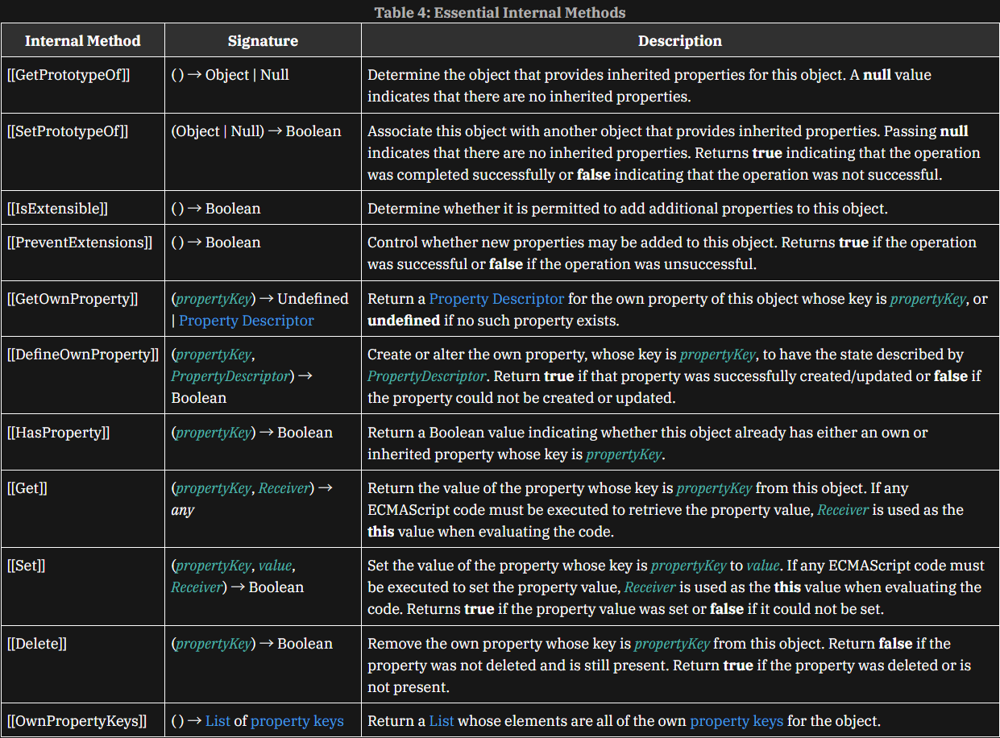
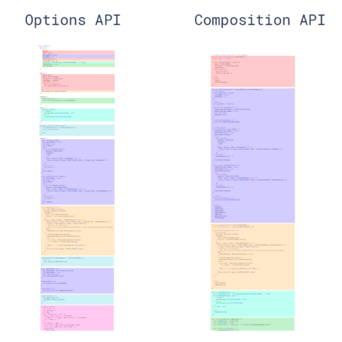

# Vue2 和 Vue3 的一些区别

## 响应式原理

Vue3 使用 Proxy 对象来实现响应式系统，而 Vue2 使用 Object.defineProperty()方法。Proxy 可以拦截对象的所有操作。而 Object.defineProperty()方法只能拦截对属性的 get 和 set。

| 特性          | Vue 2                            | Vue 3                              |
| ------------- | -------------------------------- | ---------------------------------- |
| 底层 API      | Object.defineProperty（ES5）     | Proxy（ES6）                       |
| 拦截能力      | 只能劫持对象的属性（需预先定义） | 直接代理整个对象，动态拦截所有操作 |
| 数组支持      | 需重写数组方法（如 push, pop）   | 原生支持数组索引和长度变化         |
| 新增/删除属性 | 需用 Vue.set/Vue.delete 强制更新 | 直接响应                           |
| 代理机制      | 初始化时立即递归所有属性         | 访问属性时按需代理（惰性代理）     |
| 兼容性        | ES5（广泛支持）                  | ES6（不兼容 IE11）                 |

总结：

Vue3 的 Proxy 他是直接代理整个对象，也是就说可以拦截对对象的基本操作，而 object.defineProperty()方法只基本操作的其中一个`[[DefineOwnProperty]]`。



文档地址：[ECMAScript Data Types and Values](https://tc39.es/ecma262/multipage/ecmascript-data-types-and-values.html#sec-ecmascript-data-types-and-values)

## API

Vue3 引入了组合式 API，允许将组件逻辑封装到可重用的函数中。同时，Vue3 还保留了选项式 API，以便与 Vue2 兼容。组合式 API 允许将组件逻辑拆分为更小的函数，这些函数可以被其他组件重用。而选项式 API 则允许将组件逻辑封装到选项对象中。因此，Vue3 的组合式 API 更加灵活和可重用。



## Vue3 的 ref 和 reactive

`ref` 和 `reactive` 都是 `Vue3` 中的响应式 API，但它们的使用场景和用法有所不同。

`ref` 是用来创建一个响应式对象的，它可以接受一个原始值或者一个对象作为参数，并返回一个包含该值的响应式对象。`ref` 的值可以通过 `.value` 属性来访问和修改。

`reactive` 是用来创建一个响应式对象的，它可以接受一个对象作为参数，并返回一个包含该对象的响应式副本。`reactive` 的值可以通过对象的属性来访问和修改。

为什么会出现 `ref` 和 `reactive` 两个 API 呢？为什么一个要`.value`，一个不用呢？

其实最主要的原因是`Proxy`只能代理对象，所以`ref`需要对原始值进行包装，如果遇到对象内部调用`reactive`，而`reactive`传的必须是对象。

注意事项：`reactive`解构会丢失`响应性`

```js
const state = reactive({ count: 0 });
// Proxy 拦截操作：
// state.count → 触发 get()
// state.count = 1 → 触发 set()

const { count } = state; // 解构
const count = state.count; // 直接获取原始值（非响应式）

const num = ref(0);
const { value } = num; // value 仍然是响应式（因为 num 是 RefImpl 对象）

import { reactive, toRefs } from "vue";

const state = reactive({ count: 0 });
const { count } = toRefs(state); // count 是 Ref 对象
console.log(count.value); // 通过 .value 访问
```

## 生产周期

- Vue 3 的生命周期钩子名调整（前缀 on），并支持在 setup 中使用：

- `beforeCreate` → `setup()` 替代

- `created` → `setup()` 替代

- `beforeMount` → `onBeforeMount`

- `mounted` → `onMounted`

- 其他类似（如 `onUpdated`、`onUnmounted`）。
